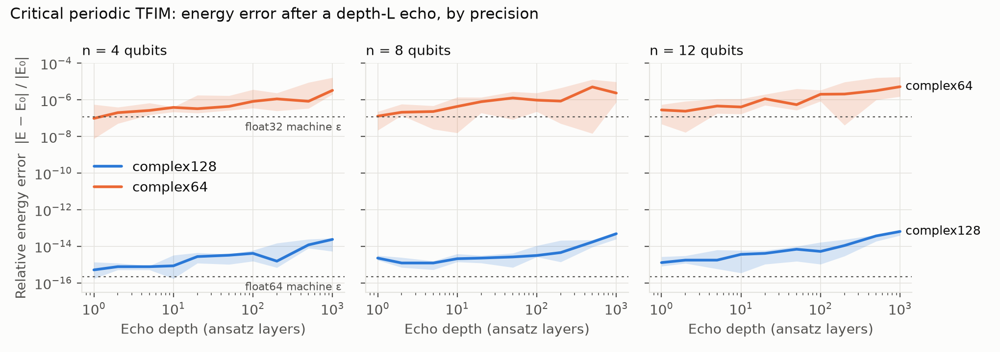

# Quantum-Simulator

A NumPy state-vector simulator for research. An n-qubit state is a `(2,)*n`
complex tensor, so every gate is a `tensordot` on its target axes and the
2ⁿ × 2ⁿ operator is never built. Gates, states, observables and partial
traces match Qiskit exactly, and a parity test suite checks this.

```python
import numpy as np
from quantum_simulator import State, gates, PauliSum
from quantum_simulator.entanglement import entanglement_entropy

bell = State.zero(2).apply(gates.H, [0]).apply(gates.CX, [0, 1])
entanglement_entropy(bell, [0])                  # 1.0 bit

h = PauliSum([("XX", 1), ("YY", 1), ("ZZ", 1)])
energy, ground = h.ground_state()                # -3.0, the singlet

State.zero(20, dtype=np.complex64).nbytes / 2**20   # 8.0 MiB instead of 16.0
```

## Setup

```sh
pip install -r requirements.txt     # numpy; qiskit and matplotlib are optional
python -m unittest discover         # 124 tests; the 17 Qiskit tests skip without qiskit
```

## Conventions

- **Qubit order is Qiskit's (little-endian).** Qubit `t` is bit `t` of the
  flat index, which puts it on tensor axis `n - 1 - t`. Labels read with
  qubit 0 on the right: `"01"` has qubit 0 in `|1>`.
- **Gate matrices are Qiskit's.** For a gate on `qubits`, `qubits[0]` is the
  matrix's least significant bit, so `CX` on `[control, target]` is
  Qiskit's `CXGate` matrix, not the textbook one.
- **Precision is a parameter.** Every state constructor takes `dtype`
  (`complex128` by default, or `complex64`), and every operation preserves
  it. Gates are stored in complex128 and rounded to the state's precision
  when they're applied.

| Module | Contents |
|---|---|
| `state` | `State`, the index convention, `apply_gate`, precision handling |
| `linalg` | inner product, fidelity, unitary/Hermitian checks, `kron` |
| `gates` | standard gates and rotations, `controlled()`, `fuse()` |
| `observables` | `PauliSum`: expectation and variance without building the matrix, exact diagonalization |
| `entanglement` | Schmidt decomposition, reduced density matrices, von Neumann/Rényi entropy |

## The linear algebra, and where it lives

| Concept | Physical meaning | Implementation |
|---|---|---|
| Complex unit vector | A pure state | `State.psi`, a `(2,)*n` complex array; norm checked on construction |
| Inner product ⟨φ\|ψ⟩ | Overlap, fidelity | `linalg.inner` (`np.vdot`, conjugates the first argument), `linalg.fidelity` |
| Unitary U (U†U = I) | A gate | 2×2 and 4×4 arrays in `gates`; constants are read-only |
| Matrix–vector product | Applying a gate | `state.apply_gate`: `np.tensordot` on the target axes, then `np.moveaxis` |
| Matrix product B·A | Gate A, then gate B | `gates.fuse(A, B)` via `functools.reduce`; arguments in time order |
| Tensor product ⊗ | Combining systems | `State.tensor` (`np.multiply.outer`); `linalg.kron` only for small operators |
| Hermitian H = H† | An observable | `PauliSum` with real coefficients; `linalg.is_hermitian` |
| Eigendecomposition | Energy levels, ground states | `PauliSum.eigh` / `ground_state` (`np.linalg.eigh`, dense, ≤ 12 qubits by default) |
| Singular value decomposition | Schmidt decomposition, entanglement | `entanglement.schmidt_decomposition` (`np.linalg.svd`) |

The only places a 2ⁿ × 2ⁿ matrix is ever built are `PauliSum.to_matrix` and
the exact diagonalization that uses it. Expectation values, variances and
`H|ψ⟩` apply one Pauli at a time to the state tensor.

## How correctness is checked

Each layer of tests checks the code against something that shares no logic
with it:

| Test file | Tests | Checks against |
|---|---|---|
| `test_state.py` | 26 | [`tests/reference.py`](tests/reference.py): naive loops over bit patterns that build full matrices, for gates on adjacent, non-adjacent and reversed qubits |
| `test_linalg.py` | 6 | Definitions: conjugation of the first argument, unitarity, Hermiticity, Kronecker order |
| `test_gates.py` | 11 | Algebraic identities (RX(π) = −iX, SX² = X, HZH = X, …), fusion order, controlled gates |
| `test_standard_gates.py` | 33 | What X, Y, Z, H, S, T, RX, RY, RZ, CNOT and CZ *do*: action on basis states and eigenstates, Pauli algebra, phase-gate powers, rotation laws and Bloch-sphere geometry, CNOT/CZ truth tables, Bell states, phase kickback; state tests run in both precisions |
| `test_observables.py` | 12 | Known physics: Heisenberg singlet at −3, two-site Ising ground energy −√(1+4g²), zero variance in eigenstates |
| `test_entanglement.py` | 7 | Bell and GHZ entropies, product states, a brute-force partial trace |
| `test_precision.py` | 12 | complex64 stays complex64 through every operation and agrees with complex128 to single precision |
| `test_qiskit_parity.py` | 17 | Qiskit 2.x, exactly rather than up to global phase: every gate matrix, 20 random circuits, probabilities, labels, `SparsePauliOp`, `partial_trace`, `entropy` |

To confirm the gate tests can actually fail, nine bugs were planted in the
gates one at a time. These included a wrong sign on Y, S swapped for S†,
RX rotating the wrong way, the textbook CNOT ordering, and CZ putting its
phase on the wrong state. Each one made between 5 and 13 tests in
`test_standard_gates.py` fail. Making RZ equal to the phase gate changes it
only by a global phase, which no measurement can see, so only the
matrix-level tests catch that one.

The tests have caught two real bugs so far:

- A `State` built from an eigenvector column kept that column's strided
  memory layout, so `.vector` returned an array Qiskit's native code
  rejects. `State` now stores a contiguous copy.
- Combining a complex64 state with a complex128 one promoted the result to
  complex128 and then checked its norm at complex128 tolerance, which the
  complex64 factor's rounding error fails. The check now uses the looser
  of the two tolerances.

## What complex64 costs

Halving the bytes per amplitude buys **one** extra qubit at a fixed memory
budget, not twice as many qubits: a 2ⁿ-amplitude state takes 2ⁿ × 16 bytes in
complex128 and 2ⁿ × 8 in complex64. The question is what that qubit costs in
accuracy, so [`experiments/precision.py`](experiments/precision.py) measures
it on a problem with a known answer.

**Setup.** The periodic transverse-field Ising chain at its critical point,
H = −Σ ZᵢZᵢ₊₁ − Σ Xᵢ. Its ground energy has a closed form,
E₀ = −Σₖ √(2 − 2 cos k) with k = π(2m+1)/n, which the script also checks
against exact diagonalization. Starting from the exact ground state, it
applies L layers of RY/RZ rotations on every qubit plus a CX ring, then
their exact inverse. In exact arithmetic the state comes back to the ground
state, so whatever energy error remains is rounding, accumulated over
6nL gates the way it would be in a long variational loop. Each precision
runs the whole pipeline (state, gates, energy) in that precision. Results
are over 5 random seeds.

<picture>
  <source media="(prefers-color-scheme: dark)" srcset="experiments/figures/precision-dark.png">
  
</picture>

*Lines are the median over 5 seeds; bands span min to max. Dotted lines mark
machine epsilon.*

Relative energy error |E − E₀| / |E₀| after a depth-1000 echo (24,000–72,000
gates):

| n | complex64 | complex128 | complex64, renormalized | complex128, renormalized |
|---|---|---|---|---|
| 4 | 3.3e-6 | 2.4e-14 | 2.6e-8 | 1.7e-16 |
| 8 | 2.3e-6 | 4.8e-14 | 1.0e-7 | 1.7e-16 |
| 12 | 5.0e-6 | 6.4e-14 | 2.4e-7 | 2.3e-16 |

Time per single-qubit gate (median of 15; NumPy 2.5.3, one Windows machine):

| n | complex64 | complex128 | speedup | memory (c64 / c128) |
|---|---|---|---|---|
| 20 | 4.0 ms | 6.2 ms | 1.6× | 8 / 16 MiB |
| 22 | 12.4 ms | 20.7 ms | 1.7× | 32 / 64 MiB |
| 24 | 41.4 ms | 82.9 ms | 2.0× | 128 / 256 MiB |

**What this shows:**

1. **complex64 costs about 8 decimal digits of energy accuracy.** Its error
   starts at machine epsilon (~1e-7) and grows to a few parts per million
   after 1,000 layers. Whether that matters depends on the absolute scale:
   chemical accuracy (1.6 mHa) on a molecular total energy of about 100 Ha
   is 1.6e-5 relative. At depth 1000 the median complex64 run meets that
   by a factor of 3–7, but the worst seed at n = 12 (1.8e-5) already misses
   it, and the margin shrinks as circuits get deeper. Renormalizing (item 3)
   restores a wide margin. Raw complex64 is not enough for resolving gaps
   or energy differences below about 1e-5 relative.
2. **The error grows like √L.** The fitted log-log slope of the median
   error against depth is 0.4–0.7 for both precisions. That fits rounding
   errors that add up as a random walk rather than in one direction.
3. **Nearly all of the growth is drift in the norm.** For complex64 the
   relative energy error is almost exactly twice the norm error
   |‖ψ‖ − 1|, as expected since E is quadratic in ψ. Reporting the
   Rayleigh quotient ⟨ψ|H|ψ⟩ / ⟨ψ|ψ⟩ instead of ⟨ψ|H|ψ⟩ brings the depth-1000
   complex64 error back to ε level (≤ 3e-7, with the norm itself computed in
   float32), at the cost of one extra inner product. **Caveat:** that recovery is this large because the echo ends in
   an eigenstate, where errors in the state's direction move the energy only
   at second order. Near a variational minimum, which is where VQE ends up,
   the same holds. Far from one it doesn't.
4. **The speedup is 1.6–2×, growing with n** as the state stops fitting
   in cache. Together with half the memory, that's the gain to set against
   items 1 and 3.

Reproduce with `python -m experiments.precision` (about 4 minutes). It
writes the raw numbers to `experiments/results/precision.json` and both
figures, and takes `--sizes`, `--depths`, `--seeds` and `--g`.

## Project layout

```text
quantum_simulator/
  state.py          State, index convention, apply_gate, precision
  linalg.py         inner, fidelity, dagger, unitary/Hermitian checks, kron
  gates.py          gate matrices, controlled(), fuse()
  observables.py    PauliSum, exact diagonalization
  entanglement.py   Schmidt decomposition, reduced density matrices, entropies
tests/
  reference.py      naive loop-based implementations used as ground truth
  test_*.py         124 tests (see above)
experiments/
  precision.py      complex64 vs complex128 energy-error study
  results/          raw numbers (precision.json)
  figures/          precision-light.png, precision-dark.png
requirements.txt
```

## Status and limitations

Done so far:

1. The `(2,)*n` state representation and its qubit-order convention.
2. The linear algebra toolkit: states, gates, fusion, observables, exact
   diagonalization, entanglement.
3. Exact parity with Qiskit, checked by tests.
4. Precision as a parameter, with a measured accuracy and speed cost.
5. Behavior tests for the standard gates (X, Y, Z, H, S, T, RX, RY, RZ,
   CNOT, CZ), with a planted-bug check that they catch real mistakes.

Not covered yet:

- **Pure states only.** There are no density-matrix states, noise channels or
  mid-circuit measurement. Reduced density matrices exist only as an output
  of `entanglement`.
- **Exact diagonalization is dense**, so it's capped at 12 qubits by default
  (`max_qubits` raises the cap). A sparse or Lanczos solver would go further.
- **Tested in one environment:** Python 3.14, NumPy 2.5.3, Qiskit 2.5.2 and
  matplotlib 3.11.2 on Windows 11. The minimum versions in
  `requirements.txt` haven't been tested, and there is no CI.
- **The precision study covers one model and one ansatz**, and its timings
  come from one machine. Other Hamiltonians, deeper circuits or
  non-eigenstate targets may behave differently, especially point 3 of its
  findings.
